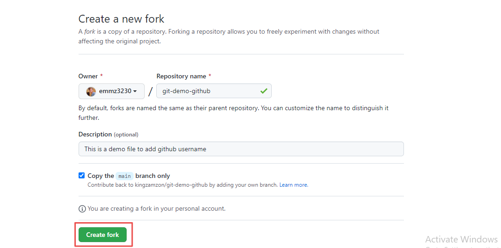
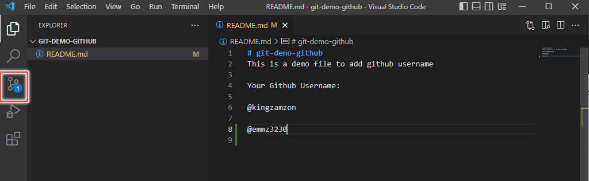
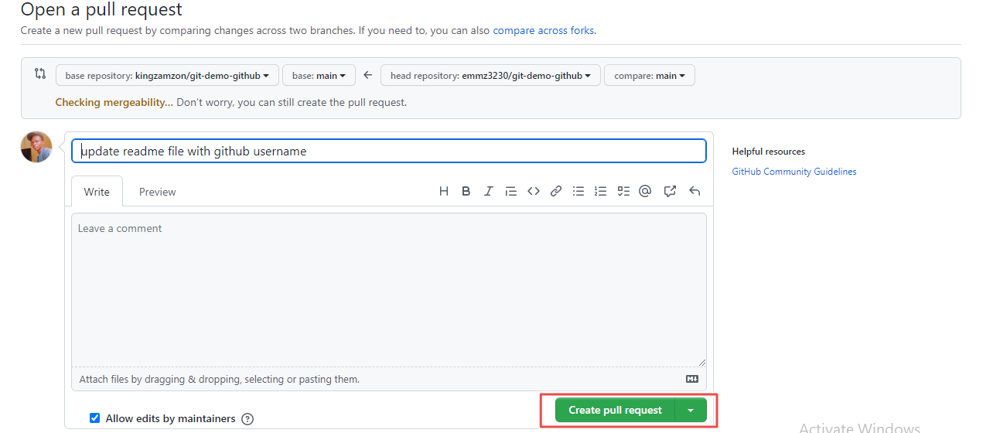

## Introduction to GitHub

Have you ever thought of going back to the changes you made to a file in last 2 days after shutting down your laptop? Good news, you can do that with version control system. Version control system are tools that let you have different versions of your file e.g Git.
But what if the file goes missing on your laptop? There are various online version control system e.g GitHub.
GitHub is an online version of Git. I will work you through basics of GitHub in this article.

## Prerequisites

- Have [Git](https://github.com/git-guides/install-git) installed on your local machine.
- Have [GitHub](https://github.com/) Account.

## What is GitHub?

GitHub is the online version of Git. It host the largest source code in the world e.g [Linux kernel](https://GitHub.com/torvalds/linux), [vscode](https://github.com/microsoft/vscode) e.t.c
GitHub is owned by Microsoft, it offers features such as [code reviews](https://github.com/features/code-review), [codespaces](https://github.com/features/codespaces), [Copilot](https://github.com/features/copilot), [Actions](https://github.com/features/actions) e.t.c
It is used by top companies in the world such as Stripe, Spotify, Uber, Slack e.t.c

## Why GitHub?

Though there are alternatives to GitHub, what makes GitHub stand out are:

- It serves as home to 90% of Fortune 100 Companies.
- It offers tools that ease collaboration.
- It has an amazing user interface that is easy to navigate.
- It serves as a centralized server to store files/folder.
- It is free.

## Git vs GitHub

Git is a decentralized version control system. It is used to track changes on files, enable collaboration on files.

GitHub is a web based version of Git on the internet.

## Clone

Clone a repository is pulling down a full copy of repository to your local machine.

1. Navigate to the repository you want to clone, in this example I will clone the [Git Demo Github](https://github.com/kingzamzon/git-demo-github) repository.
2. Click on the green `<> code` button.
3. Copy the url for the repository by clicking on the copy button  using the SSH option.
   
4. Open Your Terminal
5. Type `git clone` and paste the link you copied in 3, press enter to start cloning. Depending on the dependencies in the repository it might take some time to clone.
   

## Pull Request(PR)

Pull Request(PR) is a way to contribute to repository on GitHub. It is a mechanism for a developer to notify team members that they have completed a feature.

1. Fork the repository, by clicking on the fork button. In this example I using the [Git Demo Github](https://github.com/kingzamzon/git-demo-github) repository.

   

2. You will be navigated to the create a new fork section in which you can change the name of the repository name. When you done, Click on the `Create fork` button.
   

3. Clone the repository using above clone section.

4. In your terminal, change directory into git-demo-github using `cd git-demo-github`

5. Open the clone repository with your favourite code editor e.g visual studio code(VSCode)

6. Edit the **README.md** file; add your github username and save. With VS Code, you get notification of the changes with the source control icon.

7. Return to your already open terminal be sure you are in the right folder. Stage all changes using `git add .` or use `git add README.md`, to stage only the README.md file. If you didn't see any message it means success.
   

8. You can use `git status` command to check the current stage and changes made.

9. Still in the terminal, enter `git commit -m "update readme file with github username"`
   

10. Navigate to your forked repository on GitHub, and click on **contribute > Open pull request**.
    
11. You will be navigated to Open Pull Request section with the recent commit message that you added. Click on the green `create pull request` button.
    
12. Congratulation you just create your first pull request.
    

## Commit

Commit is used to capture a snapshot of repository currently staged changes.

To commit a file, use the command `git commit -m "commit message"`.
`commit message` is the short descriptive message of what you did.

## GitHub Desktop vs. GitHub CLI

If you are new to GitHub and you love Grahics User Interface(GUI) GitHub Desktop is the best option cause you have all tool to manage all GitHub without seeing the command line.

GitHub CLI brings GitHub commands like making PR, actions and raising issues e.t.c to the terminal without interfacing with the GitHub Website.

## Conclusion

In what ever world you choose, GitHub Desktop or GitHub CLI, don't forget to share your codes with the world.
