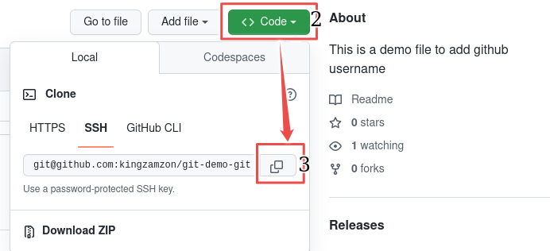

## Introduction to GitHub

Have you ever thought of going back to the changes you made to a file in last 2 days after shutting down your laptop? Good news: Version control system are tools that let you have different versions of your file. But what if you lost the file totally on your laptop? GitHub is an online version control system for your local repository/folder.
One of the popular version control system is Git.
Git ease collaboration and tracking of file.
GitHub is an online version of Git. I will work you through basics of GitHub in this article.

## Prerequisites

- Have Git installed on your local machine.
- Have GitHub Account.

## What is GitHub?

GitHub is the online version of Git. It host the largest source code in the world.

## Why GitHub?

GitHub cause it houses all the popular source codes ranging from react to Linux kernel. It's popularity make it easy to reach other developers around the world.

## Git vs. GitHub

Git is a version control system. It is used to track changes on files, enable collaboration on files.

GitHub is a web based version of Git on the internet.

## Clone

Clone a repository is pulling down a full copy of repository to your local machine.

1. Navigate to the repository you want to clone, in this example we will use clone the [Linux kernel](https://GitHub.com/torvalds/linux)
2. Click on the green <> code button.
3. Copy the url for the repository by clicking on the copy button  using one of the option HTTPS, SSH or GitHub CLI
   
4. Open Your Terminal
5. Type `git clone` and paste the link you copied in 3, press enter to start cloning.

## Pull request

Pull Request is a way to contribute to repository on GitHub. It is a mechanism for a developer to notify team members that they have completed a feature.

1. Fork the repository, by clicking on the fork buton. In this example I am using this repo [App-Ideas Repository](https://GitHub.com/DannieBabz/App-Ideas--JS)

2. You will be navigated to the create a new fork section in which you can change the name of the repository name. When you done, Click on the `Create fork` button.

3. Clone the repository using the instruction above on clone instruction.

4. In your terminal, create a new branch and switch to the branch using ` git checkout -b new-branch`

5. Open the clone repository with your favourite code editor e.g visual studio code(VSCode)

6. Edit the file, you want to edit, in my case its the README.md file. With VS Code, you get notification of the changes in the source control icon.
7. Once you have modified the file, stage it using `git add .`, which will stage all the update you have made so far.
   If you didn't see any message it means success.

8. You can use `git status` command to check the current stage and changes made.

9. Still in the terminal, enter `git commit -m "update readme file with link to project readme`
   
10. Push your branch to GitHub using `git push --set-upstream origin new-branch`
11. Navigate to the repository on GitHub, and clicked on Pull requests on the menu.
    
12. Click on `New pull request` green button. Change branch to your new created branch. Change the your repo branch to the new branch you just created.
    
13. Click on `Create pull request` button. Then click on Create pull request button at the button.
    
14. Congratulation you just create your first pull request.
    

## Commit

Commit is used to capture a snapshot of repository currently staged changes.

To commit a file, use the command `git commit -m "commit message"`.
`commit message` is the short descriptive message of what you did.

## GitHub Desktop vs. GitHub CLI

If you are new to GitHub and you love Grahics User Interface(GUI) GitHub Desktop is the best option cause you have all tool to manage all GitHub without seeing the command line.

GitHub CLI brings GitHub commands like making PR, actions and raising issues e.t.c to the terminal without interfacing with the GitHub Website.

## Conclusion

In what ever world you choose, GitHub Desktop or GitHub CLI, don't forget to share with the world.
